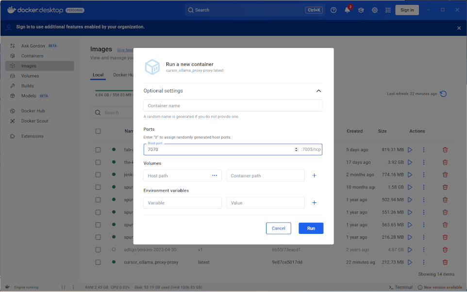

# Setup a Open AI -> Ollama Proxy

The following github project is actually mis-named and is really a openAi -> Ollam proxy for the REST calls that come out of the openAi APIs;

[cursor_ollama_proxy](https://github.com/punnerud/cursor_ollama_proxy/tree/main#)

If your running Docker Desktop after you do;

```
docker-compose up -d
```

Then open docker desktop and run it on port 7070

